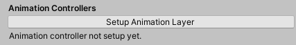

# EyesKit

## Credits

Mothblocks, Peptron1

## Usage

After importing the unitypackage...

### 1. Create EyesKit handler

Create the EyesKit handler through the dropdown menu at the top.

You should see the below UI.

### 2. Fill in avatar fields

Drag and drop the avatar descriptor from the explorer into the **"Avatar Descriptor" field**.

The UI should then look similar to the below.

Fill in the newly shown **"Head", "Left Wrist", and "Right Wrist" fields** with the appropriate objects. The left and right wrists will be where the cameras go--this might be named "Left Hand" or similar instead of wrist.

After doing so, your UI should look similar to the below.

You should now have access to the "Eye Quads" section.

### 3. Create eye quads

The eye quads contain the target texture for the camera and the shader to position them towards you.

Select your headset settings (or set your screen width and height manually), and click **Make Eye Quads**.

There should be no configuration for this part. After the eye quads are made, your UI should look like the following:

You should now have access to the "Cameras" section.

### 4. Cameras

Click either **Setup Left Camera**. This will automatically select the object your left hand camera will look from. When this is setup, click **Setup Right Camera** and repeat the process.

Your UI will look the same as before, but you will now have camera holders in the same place.

If you mess up at any point, you can search for `CameraHolder` in your avatar and change the settings there, or click "Reset Cameras" to remove both. You can also click the setup buttons again in order to replace the old camera for that hand with a new one.

### 5. Mesh (for blendshapes)

**If your avatar is one mesh**, drag the body into the **Single Mesh** object and click **Copy Mesh to All**.

**If your avatar is more than one mesh**, click the **Non-Single Mesh Properties** dropdown, and drag the directed meshes into each field.

When you successfully complete either, you will see the below UI.

### 6. Blendshapes

Select the blendshape for **closing the eyes** for the **Left Eye Blendshape** and **Right Eye Blendshape** fields. This might look like the below.

For the hands, you have two options, chosen from the **Hand Behavior** field.

#### Hand Behavior - Blendshapes

The default is blendshapes. If your mesh comes with eyes already in the mesh, you can fill in the blendshapes for the left and right hand eyes. This might look like the below.

#### Hand Behavior - Chalk Eyes

If your avatar does not have anything like this, you can resort to the fallback **Chalk Eyes**. Click the **Hand Behavior** dropdown, and select **Chalk Eyes**.

This will then provide you with **Setup Left Chalk Eye** and **Setup Right Chalk Eye**. The process here is the same as the cameras--clicking either of these will give you an object that you should rotate, scale, etc until it looks right.

It might look like the below.

### 7. Animation Layer

After setting up your blendshapes, you should now see the following at the bottom.

Clicking **Setup Animation Layer** will do the following:

1. Create the FX layer if it doesn't exist
2. Add in an animation layer called "EyesKit" to your FX layer

You should just have to click this button in order to finish.

You can test this by clicking on your model, and opening up the Animation tab.

You should see the following animations:

In order to test this, choose the one called "Left_Eye". Click **Preview**.

You should be able to observe the following behavior.

You should now be able to publish the model and have it work fine.

## Known Issues

### Camera is upside down/otherwise pointed incorrectly

A VRChat bug might cause the camera to be inverted in the first few worlds you load the avatar in. Try simply going to other worlds and see if the problem fixes itself.

Otherwise, this can happen if your model is not in a proper T-pose. Search for `CameraHolder` and rotate it until the camera is correct in game.

For assistance, you can enable the inside "Camera" object, and turn on Gizmos in unity to see the camera frustum.

Make sure to disable the "Camera" object again afterwards.
